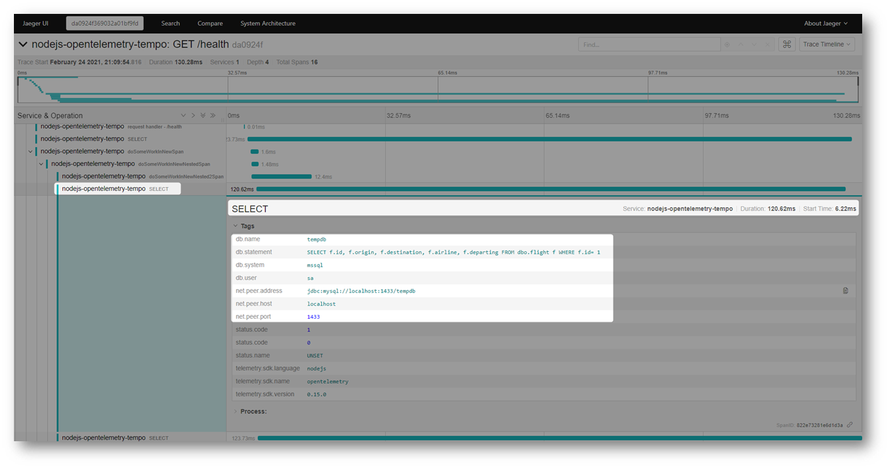

# OpenTelemetry mssql Instrumentation for Node.js

This module provides automatic instrumentation for [mssql](https://www.npmjs.com/package/mssql)

There are two variations 

# Instrumention Variation

This is the **recomended variation**. The source code can be found [here](https://github.com/mnadeem/opentelemetry-instrumentation-mssql/tree/instrumentation)

**In Progress**

# Plugin Variation

This variation would be **depreciated soon**. The source code can be found [here](https://github.com/mnadeem/opentelemetry-instrumentation-mssql/tree/plugin)

## Installation

````
npm install --save opentelemetry-plugin-mssql
````

## Usage

````
import {LogLevel} from '@opentelemetry/core'
import {NodeTracerProvider} from '@opentelemetry/node'
import {registerInstrumentations} from '@opentelemetry/instrumentation'

// Enable OpenTelemetry exporters to export traces to Grafan Tempo.
const provider = new NodeTracerProvider ({
    plugins: {
        mssql: {
            enabled: true,
            // You may use a package name or absolute path to the file.
            path: "opentelemetry-plugin-mssql",
        },
    },
    logLevel: LogLevel.ERROR,      
});

registerInstrumentations({
    tracerProvider: provider
});
````

## Sample Trace



## Instrumentation

**Supported**

* `Request.query`
* `ConnectionPool.query`

**Future**

* `Request.execute`
* `Request.batch`
* `Request.bulk`
* `ConnectionPool.batch`